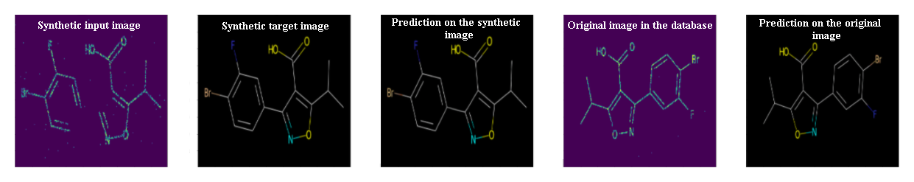

# AutoEncoder

This is a presentation of a **[PyTorch](https://pytorch.org) AutoEncoder used in the [BMS-Molecular-Translation competition](https://www.kaggle.com/c/bms-molecular-translation)**. 

Basic knowledge of PyTorch, convolutional networks is assumed.

Questions, suggestions, or corrections can be posted as issues.

I'm using `PyTorch 1.7.1` in `Python 3.8.5`.

---

# Contents

[***Objective***](https://github.com/Fpiotro/MOLECULAR-TRANSLATION/tree/main/AutoEncoder#objective)

[***Concepts***](https://github.com/Fpiotro/MOLECULAR-TRANSLATION/tree/main/AutoEncoder#concepts)

[***Overview***](https://github.com/Fpiotro/MOLECULAR-TRANSLATION/tree/main/AutoEncoder#overview)

[***Implementation***](https://github.com/Fpiotro/MOLECULAR-TRANSLATION/tree/main/AutoEncoder#implementation)

[***Training***](https://github.com/Fpiotro/MOLECULAR-TRANSLATION/tree/main/AutoEncoder#training)

[***Inference***](https://github.com/Fpiotro/MOLECULAR-TRANSLATION/tree/main/AutoEncoder#inference)

# Objective

**AutoEncoder is based on Unet architecture whose goal is to remove the disturbances on the images of molecules, to give color to the molecules, and to reconstruct the missing bonds.**

This is possible because of its U-net architecture, which allows it to focus on the aspects (color, noise, erasure) of the image that is most relevant for reconstruction.

In addition, the results of the autoencoder will allow the use of a [YOLO algorithm](https://github.com/ultralytics/yolov5) in the rest of the project, which aims to detect bonds and atoms in order to predict the corresponding [International Chemical Identifier (InChI)](https://en.wikipedia.org/wiki/International_Chemical_Identifier).

Here are some results generated on _test_ images not seen during training or validation:

---

  

---

  

---

  

---

There are more examples at the [end of the tutorial](https://github.com/Fpiotro/MOLECULAR-TRANSLATION/tree/main/AutoEncoder#some-more-examples).

---

# Concepts

* **AutoEncoder**: A classical image autoencoder takes an image, maps it to a latent vector space via an encoder module, and then decodes it back to an output with the same dimensions as the original image, via a decoder module. It’s then trained by using as target data the same images as the input images, meaning the autoencoder learns to reconstruct the original inputs. By imposing various constraints on the code (the output of the encoder), you can get the autoencoder to learn more-or-less interesting latent representations of the data.

* **Denoising AutoEncoder**: This is a special kind of autoencoder, first explored in 2008 by Vincent et al. It basically works with corrupt data as its inputs and attempts to reconstruct the noisy signal. It manages that by abstracting what is called the manifold of the data, which is the shape we wish to capture when the dimensionality of the data is reduced. Once a form of the manifold is abstracted based on the input data, the autoencoder rebuilds that signal and outputs what it believes to be a more accurate representation of the original inputs.

# Overview

In this section, we will present an overview of this model. If you're already familiar with it, you can skip straight to the [Implementation](https://github.com/Fpiotro/MOLECULAR-TRANSLATION/tree/main/AutoEncoder#implementation) section or the commented code.

### AutoEncoders

An autoencoder is the combination of an encoder function that converts the input data into a different representation, and a decoder function that converts the new representation back into the original format. Autoencoders are trained to preserve as much information as possible when an input is run through the encoder and then the decoder, but are also trained to make the new representation have various nice properties. Different kinds of autoencoders aim to achieve different kinds of properties.

An autoencoder is a neural network that is trained to attempt to copy its input to its output. Internally, it has a hidden layer h that describes a code used to represent the input. The network may be viewed as consisting of two parts: an encoder function *h = f(x)* and a decoder that produces a reconstruction *r = g(h)*. 

If an autoencoder succeeds in simply learning to set *g(f(x)) = x* everywhere, then it is not especially useful. Instead, autoencoders are designed to be unable to learn to copy perfectly. Usually they are restricted in ways that allow them to copy only approximately, and to copy only input that resembles the training data. Because the model is forced to prioritize which aspects of the input should be copied, it often learns useful properties of the data.
Modern autoencoders have generalized the idea of an encoder and a decoder beyond deterministic functions to stochastic mappings *pencoder(h|x)* and *pdecoder(x|h)*.

  
  

    The general structure of an autoencoder, mapping an input <i>x</i> to an output (called reconstruction) <i>r</i> through an internal representation or code <i>h</i>. The autoencoder has two components: the encoder <i>f</i> (mapping <i>x</i> to <i>h</i>) and the decoder <i>g</i> (mapping <i>h</i> to <i>r</i>).
  

  <b> This section was built with: <a href="https://www.deeplearningbook.org/">Ian Goodfellow, Yoshua Bengio, and Aaron Courville (2016) <i>Deep Learning (Adaptive Computation and Machine Learning).</i> In Deep Learning Research, pages 502–503. MIT Press.</a>
  </b>

### Denoising AutoEncoders

The denoising autoencoder (DAE) is an autoencoder that receives a corrupted data point as input and is trained to predict the original, uncorrupted data point
as its output. We introduce a corruption process *C(x̃|x)* which represents a conditional distribution over corrupted samples *x̃*, given a data sample *x*. 

  
  

    The computational graph of the cost function for a denoising autoencoder, which is trained to reconstruct the clean data point <i>x</i> from its corrupted version <i>x̃</i>. This is accomplished by minimizing the loss <i>L = −log pdecoder(x|h = f(x̃))</i>, where <i>x̃</i> is a corrupted version of the data example <i>x</i>, obtained through a given corruption process <i>C(x̃|x)</i>. Typically the distribution <i>pdecoder</i> is a factorial distribution whose mean parameters are emitted by a feedforward network <i>g</i>.
  

The autoencoder then learns a reconstruction distribution *preconstruct(x|x̃)* estimated from training pairs *(x,x̃)*, as follows:
1. Sample a training example *x* from the training data.
2. Sample a corrupted version *x̃* from *C(x̃|x = x)*.
3. Use *(x,x̃)* as a training example for estimating the autoencoder reconstruction distribution *preconstruct(x|x̃) = pdecoder(x|h)* with *h* the output of encoder *f(x̃)* and *pdecoder* typically defined by a decoder *g(h)*.

Typically we can simply perform gradient-based approximate minimization (such as minibatch gradient descent) on the negative log-likelihood *−log pdecoder(x|h)*. So long as the encoder is deterministic, the denoising autoencoder is a feedforward network and may be trained with exactly the same techniques as any other feedforward network.

  <b> This section was built with: <a href="https://www.deeplearningbook.org/">Ian Goodfellow, Yoshua Bengio, and Aaron Courville (2016) <i>Deep Learning (Adaptive Computation and Machine Learning).</i> In Deep Learning Research, pages 510–512. MIT Press.</a>
  </b>

### U-Net

The main idea is to supplement a usual contracting network by successive layers, where pooling operators are replaced by upsampling operators. Hence, these layers increase the resolution of the output. In order to localize, high resolution features from the contracting path are combined with the upsampled output. A successive convolution layer can then learn to assemble a more precise output based on this information. One important modification in this architecture is that the upsampling part has also a large number of feature channels, which allow the network to propagate context information to higher resolution layers. As a consequence, the expansive path is more or less symmetric to the contracting path, and yields a u-shaped architecture. The network does not have any fully connected layers and only uses the valid part of each convolution, i.e., the segmentation map only contains the pixels, for which the full context is available in the input image.

  
  

    U-net architecture (example for 32x32 pixels in the lowest resolution). Each blue box corresponds to a multi-channel feature map. The number of channels is denoted on top of the box. The x-y-size is provided at the lower left edge of the box. White boxes represent copied feature maps. The arrows denote the different operations.
  

  <b> This section was built with: <a href="https://arxiv.org/abs/1505.04597">Olaf Ronneberger, Philipp Fischer, and Thomas Bro (2015) <i>U-Net: Convolutional Networks for Biomedical Image Segmentation</i>, Computer Science Department and BIOSS Centre for Biological Signalling Studies, University of Freiburg, Germany, arXiv:1505.04597. [cs.CV]</a>
  </b>

# Implementation

The sections below briefly describe the implementation.

They are meant to provide some context, but **details are best understood directly from the code**, which is quite heavily commented.

### Dataset

You'd need to download the [BMS-Molecular-Translation data](https://www.kaggle.com/c/bms-molecular-translation/data).

### Input to model

##### Images

The synthetic images were made with the [RDKit library](https://www.rdkit.org/docs/Cookbook.html) of python.

See [`preprocess_AE.py`](https://github.com/Fpiotro/MOLECULAR-TRANSLATION/blob/main/AutoEncoder/preprocess_AE.py).

The objective of the autoencoder is to transform a black and white, porous and incomplete image into a colored, chemically coherent, and readable image.
We will use the RDKit library to obtain the target images for our autoencoder. However, the available images and the target images are different. Indeed, some images are different and transformations (rotation, homothety) must be performed to go from one image to another.

  
  

    On the left: an image available in the database in black and white. On the right: a target image generated with the RDKit library. To go from one image to another, it is necessary to carry out a rotation and a homothety so that the contents of the two images correspond. The objective of the autoencoder is to work on the form (color) and not the content of the image.
  

To make the problem easier, we decided to leave out the available images (black and white) and to start with the RDKit images to degrade them so that they have the same appearance as the available images.

  
  

    The process of degrading the original image to make the image similar to the available images in terms of characteristics (color, porosity, lack of binding).
     1: Generating the image with the RDKit library using the available InChI.
     2: Random bonds removal and 3 channels black and white (RGB) transformation.
     3: Change from 3 to 1 channel to get a greyscale image since mask to get a black and white image.
     4: Removal of pixels (1 &rarr; 0) randomly to decrease the quality of the links.
     5: Adding pixels (0 &rarr; 1) randomly to create a porosity aspect on the image.
  

The number of links, pixels to be deleted or added can be modified to choose the behavior of the autoencoder.

  
  

    In this example, the synthetic image is of lower quality than the available image. This is deliberate to obtain a robust autoencoder, capable of producing satisfactory results on different image qualities.
  

Thus the autoencoder is trained on a set of synthetic images. This is then evaluated on the available images. It is thus able to transform the training images for the rest of the project but also the test images on which we are evaluated during the competition.

  

Also, PyTorch follows the NCHW convention, which means the channels dimension (C) must precede the size dimensions.

We will resize all images to 224x224 for uniformity. However, this size is variable and can be defined by the user. A multiple of 32 is preferable if the objective is to use the entire project. This size was selected because it was suitable for the rest of the project (attention mechanism and YOLO algorithm).

Therefore, **images fed to the model must be a `Float` tensor of dimension `N, 1, 224, 224`**, and must be normalized between **`[0,1]`**. We chose this normalization because the activation function used in the U-net architecture is **[`RELU`](https://pytorch.org/docs/stable/generated/torch.nn.ReLU.html)**. **`N`** is the batch size.

### U-Net

See `UNet` in [`models_AE.py`](https://github.com/Fpiotro/MOLECULAR-TRANSLATION/blob/main/AutoEncoder/models_AE.py).

The U-Net network is simple – it's composed of `Down` and `Up` with `DoubleConv` operation.

# Training

Before you begin, make sure to save the required data files for training. To do this, run the contents of [`InChI_Label.py`](https://github.com/AntoinePlissonneau/MolecularTranslationChallenge/blob/main/InChI_Label.py).

See [`Trainer_AE.py`](https://github.com/Fpiotro/MOLECULAR-TRANSLATION/blob/main/AutoEncoder/Trainer_AE.py).

The parameters for the model (and training it) are in the **ini folder**, so you can easily check or modify them should you wish to.
To obtain this parameters folder you can:
* Download it directly from the GitHub
* Generate this folder with `python ini.py` in a python terminal (example: Anaconda Powershell Prompt)

It is possible to leave a parameter empty (e.g. checkpoint path if no checkpoint is used). Nevertheless, it is essential to have the **ini folder and the 3 files** that make it up for the proper functioning of the program. Moreover, it is necessary to have a folder named **checkpoint** at the same level, even if it is empty.

Note that we perform validation at the end of every training epoch.

### Loss Function

We use **[`MSELoss`](https://pytorch.org/docs/master/generated/torch.nn.MSELoss.html#torch.nn.MSELoss)**. This emphasizes restoring color to the images and reconstructing the missing links.

### Model Checkpoint

You can download this pretrained model [here](https://drive.google.com/file/d/17bhebttizD0tXaeZ499X4F33dboIBMgN/view?usp=sharing).

Note that this checkpoint should be [loaded directly with PyTorch](https://pytorch.org/docs/stable/torch.html?#torch.load) and mapped to the available device (CPU or GPU).

# Inference

See `Predict` in [`Trainer_AE.py`](https://github.com/Fpiotro/MOLECULAR-TRANSLATION/blob/main/AutoEncoder/Trainer_AE.py).

To produce the result of a prediction, the method implemented in the Trainer class must be used. You can generate an image or generate a PyTorch tensor to reuse it in another process (here Attention Mechanism and YOLO).

### Some more examples

---

  

---

  

---

  

---

