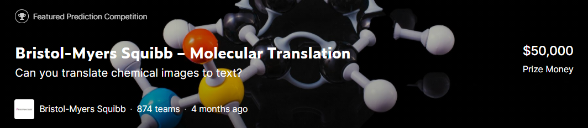

# MOLECULAR-TRANSLATION

  

This repository presents the solution developed during the **[BMS-Molecular-Translation competition](https://www.kaggle.com/c/bms-molecular-translation)**.
This one is composed of four parts:
* AutoEncoder
* Detector
* EncoderDecoder
* Initiator

These four parts were assembled in the final submission to provide an innovative and original solution 👍

## Objectives
* Automated recognition of optical chemical structures 
* Convert images back to the underlying chemical structure (InChI text) 
* Help chemists expand access to collective chemical research

## Evaluation

"[Levenshtein Distance](https://medium.com/@ethannam/understanding-the-levenshtein-distance-equation-for-beginners-c4285a5604f0) is defined as the minimum number of operations required to make the two inputs equal. Lower the number, the more similar are the two inputs that are being compared." ([Devopedia](https://devopedia.org/levenshtein-distance), 2021)

  

## International Chemical Identifier Structure (InChI)

InChI is a non-proprietary, Open Source, chemical identifier intended to be an IUPAC approved and endorsed structure standard representation.

  
   

    Features of chemical structure in a hierarchical, layered manner. Major InChI layers: Main, Charge, Stereo, Isotopic, FixedH (never included in standard InChI) as well as the Reconnected layer (never included in standard InChI), and their associated sublayers.
  

  <b> This section was built with: <a href="https://jcheminf.biomedcentral.com/articles/10.1186/s13321-015-0068-4"> Heller, S.R., McNaught, A., Pletnev, I. et al. <i>InChI, the IUPAC International Chemical Identifier.</i> J Cheminform 7, 23 (2015). https://doi.org/10.1186/s13321-015-0068-4 </a>
  </b>

## Model architecture

  
   

    Architecture of the model with the outputs associated to each branch. The final prediction is a combination of the three branches.
  

  
   

    Illustration of the Self-Supervised Learning part between the Initiator branch and the EncoderDecoder branch. The Initiator branch is voluntarily trained on a simplified problem in order to accustom the Resnet101 with images of molecules.
  

## Leaderboard

  

